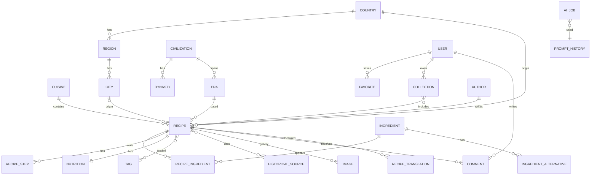

# GastrAtlas — Ürün ve Mimari Planlama Paketi (v1.0)

**The World's Living Culinary Atlas — Explore History Through Flavor**

> Bu belge, kodlamaya başlamadan önce onaylanması gereken 13 kalemlik planlama paketidir.
> Her bölümde alınan kararların kısa gerekçesi verilmiştir. Onay bekleyen kritik kararlar
> belgenin başındaki "Karar Noktaları" tablosunda özetlenmiştir.

---

## 0. ONAY BEKLEYEN KARAR NOKTALARI

| # | Karar | Önerim | Gerekçe |
|---|-------|--------|---------|
| K1 | Harita kütüphanesi | **MVP'de Leaflet + OpenStreetMap, Faz 3'te Mapbox'a geçiş opsiyonu** | Leaflet ücretsiz ve yeterli; Mapbox premium görünüm sağlar ama trafik büyüyünce maliyet üretir. Soyutlama katmanıyla ikisi de desteklenecek. |
| K2 | Dil stratejisi | **İlk günden TR + EN, çok dilli veri modeli** | "Küresel referans" hedefi tek dille kurulamaz; sonradan i18n eklemek en pahalı refactor'dur. |
| K3 | AI sağlayıcı | **Anthropic API (Claude) birincil, sağlayıcı-bağımsız adapter katmanı** | Uzun bağlamlı tarihsel doğrulama ve editoryal kalite için güçlü; adapter sayesinde kilitlenme yok. |
| K4 | MVP kapsamı | **Faz 1 = Osmanlı mutfağı, 60–100 tarif, harita + zaman çizelgesi + AI Chef (yalnızca okuma odaklı)** | Dar ve derin başlamak, geniş ve sığ başlamaktan daha güçlü marka algısı yaratır. |
| K5 | AI görsel üretimi | **Faz 2'ye ertelensin; MVP'de küratörlü fotoğraf** | Marka "authenticity" değeriyle AI görselin gerilimi var; editoryal politika netleşmeden açılmamalı. |

---

## 1. ÜRÜN GEREKSİNİMLERİ DOKÜMANI (PRD)

### 1.1 Problem Tanımı

Gastronomi içeriği internette iki kutba ayrılmış durumda: (a) SEO odaklı, tarihsel derinliği olmayan tarif siteleri, (b) erişimi zor akademik kaynaklar. İkisinin arasında, **doğrulanabilir tarihsel bağlamla sunulan, premium kalitede, yaşayan bir gastronomi ansiklopedisi** yok. GastrAtlas bu boşluğu doldurur.

### 1.2 Hedef Kitle ve Personalar

| Persona | Tanım | Temel İhtiyaç | Başarı Sinyali |
|---------|-------|---------------|----------------|
| **Meraklı Gezgin** (birincil) | 25–45, kültür ve seyahat odaklı, premium içerik tüketicisi | Bir yemeğin hikâyesini ve coğrafyasını keşfetmek | Harita/timeline üzerinden 3+ tarif gezmesi |
| **Ev Aşçısı** | Tarifi gerçekten pişirecek kullanıcı | Güvenilir ölçüler, alternatif malzemeler | Tarif tamamlama, favorileme |
| **Öğrenci / Araştırmacı** | Gastronomi, tarih, antropoloji öğrencisi | Kaynakça, dönem/medeniyet bağlantıları | Kaynak linklerine tıklama, koleksiyon oluşturma |
| **Editör / Tarihçi** (iç kullanıcı) | İçerik üreten ekip | AI destekli üretim + doğrulama akışı | Taslak → yayın süresi |

### 1.3 Ürün Hedefleri (MVP — ilk 6 ay)

1. Osmanlı mutfağı odaklı 60–100 tam donanımlı tarif (tarihçe + kaynak + harita + alternatif malzeme).
2. Dünya haritası ve zaman çizelgesi ile **keşif-öncelikli** gezinme (arama değil, keşif ana paradigma).
3. AI Chef Asistanı (soru-cevap + alternatif malzeme önerisi) — üretim değil, rehberlik modunda.
4. Tam admin paneli ile editoryal akış: Taslak → AI Doğrulama → Editör Onayı → Yayın.
5. Teknik SEO altyapısının %100 tamam olması (Recipe Schema, sitemap, OG, Core Web Vitals ≥ 90).

### 1.4 Kapsam Dışı (MVP'de bilinçli olarak YOK)

- Kullanıcı tarafından tarif ekleme (UGC) — kalite kontrolü olgunlaşmadan açılmaz.
- Yorum sistemi (altyapı hazır, UI Faz 2'de açılır).
- AI görsel üretimi (K5), podcast/video modülleri (içerik operasyonu gerektirir).
- Mobil uygulama — responsive web önce.

### 1.5 Başarı Metrikleri

| Metrik | Hedef (MVP+3 ay) |
|--------|------------------|
| Organik oturum / ay | 25.000 |
| Ortalama oturum süresi | > 3 dk |
| Tarif başına gezilen ek sayfa | ≥ 2 (keşif tasarımının kanıtı) |
| Newsletter dönüşümü | %2,5 |
| Core Web Vitals (LCP/CLS/INP) | Yeşil, mobil dahil |
| Editoryal döngü (taslak→yayın) | < 48 saat |

### 1.6 Temel Kullanıcı Akışları

1. **Keşif akışı:** Ana sayfa haritası → ülke → dönem filtresi → tarif → benzer tarifler → koleksiyona ekleme.
2. **Pişirme akışı:** Tarif → porsiyon ayarı → alternatif malzeme motoru → yazdır/adım adım mod.
3. **AI akışı:** Tarif sayfasında "Şefe Sor" → bağlamı tarif olan sohbet → alternatif önerisi → tarifin dinamik yeniden hesaplanması.
4. **Editoryal akış (admin):** AI içerik taslağı → AI tarihsel doğrulama raporu → editör düzenleme → tarihçi onayı → zamanlanmış yayın.

---

## 2. SİSTEM MİMARİSİ

### 2.1 Genel Görünüm

```
┌────────────────────────────────────────────────────────────┐
│                        VERCEL (Edge)                       │
│  ┌──────────────────────────────────────────────────────┐  │
│  │              Next.js 15 (App Router)                 │  │
│  │                                                      │  │
│  │  RSC (Server Components)  ← varsayılan render        │  │
│  │  Client Components        ← yalnızca etkileşim       │  │
│  │  Server Actions           ← mutasyonlar              │  │
│  │  Route Handlers           ← webhook / RSS / OG-image │  │
│  └───────────┬─────────────────────────┬────────────────┘  │
└──────────────┼─────────────────────────┼───────────────────┘
               │                         │
     ┌─────────▼──────────┐    ┌─────────▼──────────┐
     │  SUPABASE          │    │  AI SERVICE LAYER   │
     │  PostgreSQL + RLS  │    │  (provider adapter) │
     │  Auth (SSR cookie) │    │  Anthropic API      │
     │  Storage (images)  │    │  AIJob kuyruğu (DB) │
     └────────────────────┘    └─────────────────────┘
```

### 2.2 Katman Mimarisi (Clean Architecture uyarlaması)

| Katman | İçerik | Kural |
|--------|--------|-------|
| **UI** | `app/`, `components/` | Domain mantığı içermez, yalnızca sunum. |
| **Application** | `src/features/*/actions.ts`, `queries.ts` | Use-case'ler; validation (Zod) burada. |
| **Domain** | `src/domain/` | Saf TypeScript tipleri, iş kuralları (porsiyon hesabı, alternatif eşleme). Framework bağımsız. |
| **Infrastructure** | `src/lib/db`, `src/lib/ai`, `src/lib/storage` | Prisma, Supabase, AI adapter. Domain'e sızmaz. |

**Gerekçe:** "Yıllarca geliştirilebilir" hedefinin teknik karşılığı, framework'ün domain'e sızmamasıdır. Next.js 18'e ya da başka bir AI sağlayıcıya geçiş, yalnızca infrastructure katmanını etkiler.

### 2.3 Render Stratejisi

- **Tarif, ülke, dönem sayfaları:** SSG + ISR (`revalidate: 3600`, yayın olayında on-demand revalidation). Gerekçe: içerik nadiren değişir, SEO ve hız kritik.
- **Harita ve timeline:** RSC ile veri, client component ile etkileşim (Leaflet SSR çalışmaz → `dynamic import, ssr:false`).
- **AI Chef, favoriler, admin:** Tamamen dinamik, auth-gated.

### 2.4 AI Servis Mimarisi

```
İstek → AIService (adapter interface)
          ├── AnthropicProvider (birincil)
          └── (gelecek: başka sağlayıcılar)
        → PromptRegistry (versiyonlu prompt şablonları, DB: PromptHistory)
        → AIJob tablosu (queued → running → done/failed, maliyet + token logu)
        → Sonuç: her zaman İNSAN ONAYI gerektiren taslak olarak kaydedilir
```

Kritik ilke: **AI hiçbir zaman doğrudan yayına içerik basmaz.** AI Historical Validation dahil tüm çıktılar editoryal akıştan geçer. Bu, "Accuracy" ve "Authenticity" marka değerlerinin mimarideki karşılığıdır.

### 2.5 Çok Dillilik (i18n)

- `next-intl` + route bazlı locale: `/tr/...`, `/en/...`
- İçerik çevirileri veri modelinde `*Translation` tablolarıyla tutulur (bkz. ER). UI metinleri JSON message dosyalarında.
- AI Translation modülü çeviri taslağı üretir, editör onaylar.

### 2.6 Önbellekleme ve Performans

- Next.js Data Cache + tag bazlı invalidation (`revalidateTag('recipe:slug')`).
- Görseller: Supabase Storage → `next/image` + uzak loader, AVIF/WebP, blur placeholder.
- Harita verisi: ülke/koordinat GeoJSON'ları statik üretilir, CDN'den servis edilir.

---

## 3. VERİTABANI TASARIMI ve ER DİYAGRAMI

### 3.1 Tasarım İlkeleri

1. **Ülke-bağımsızlık:** Hiçbir tablo "Osmanlı"ya özel değildir; Cuisine/Civilization/Era genel modellerdir.
2. **Çeviri ayrıştırması:** Dile bağlı alanlar `*Translation` tablolarında (içerik ölçeklenirken şema değişmez).
3. **Zaman modellemesi:** Dönemler kesin tarih değil aralıktır (`startYear`, `endYear`, negatif = M.Ö.).
4. **AI izlenebilirliği:** Her AI çıktısı `AIJob` + `PromptHistory` ile denetlenebilir (AuditLog ile birlikte "güven" değerinin altyapısı).

### 3.2 ER Diyagramı (Mermaid)



### 3.3 Prisma Şeması — Çekirdek (özet, tam şema kod fazında)

```prisma
model Recipe {
  id            String   @id @default(cuid())
  slug          String   @unique
  status        ContentStatus @default(DRAFT)   // DRAFT, AI_REVIEW, EDITOR_REVIEW, PUBLISHED, ARCHIVED
  cuisineId     String
  countryId     String
  cityId        String?
  eraId         String?
  civilizationId String?
  latitude      Decimal? @db.Decimal(9,6)
  longitude     Decimal? @db.Decimal(9,6)
  prepMinutes   Int
  cookMinutes   Int
  servings      Int
  difficulty    Difficulty
  heroImageId   String?
  authorId      String
  publishedAt   DateTime?
  // ilişkiler: translations, ingredients, steps, sources, tags, nutrition...
  @@index([cuisineId, status, publishedAt])
  @@index([countryId, eraId])
}

model RecipeTranslation {
  id        String @id @default(cuid())
  recipeId  String
  locale    String        // 'tr', 'en', ...
  title     String
  summary   String
  history   String        // tarihsel anlatı (markdown)
  metaTitle String?
  metaDesc  String?
  @@unique([recipeId, locale])
}

model Ingredient {
  id           String @id @default(cuid())
  slug         String @unique
  category     String        // baharat, tahıl, et...
  seasonality  String?
  translations IngredientTranslation[]
}

model IngredientAlternative {
  id             String @id @default(cuid())
  ingredientId   String
  alternativeId  String        // Ingredient FK — alternatif de bir malzemedir
  type           AlternativeType  // HISTORICAL, MODERN, VEGAN, VEGETARIAN,
                                  // GLUTEN_FREE, LACTOSE_FREE, ECONOMIC,
                                  // LOCAL, SAME_AROMA, SAME_TEXTURE
  ratio          Decimal @default(1.0)  // 1 birim yerine kaç birim
  aiExplanation  String?                // AI üretimi, editör onaylı
  isVerified     Boolean @default(false)
  @@unique([ingredientId, alternativeId, type])
}

model RecipeIngredient {
  id           String  @id @default(cuid())
  recipeId     String
  ingredientId String
  quantity     Decimal
  unit         Unit          // G, KG, ML, L, TSP, TBSP, CUP, PIECE, PINCH
  note         String?
  isOptional   Boolean @default(false)
  sortOrder    Int
  @@unique([recipeId, ingredientId])
}

model Era {
  id             String @id @default(cuid())
  slug           String @unique
  civilizationId String?
  dynastyId      String?
  startYear      Int          // negatif = M.Ö.
  endYear        Int?
  translations   EraTranslation[]
}

model HistoricalSource {
  id          String @id @default(cuid())
  type        SourceType   // MANUSCRIPT, BOOK, ACADEMIC_PAPER, ARCHIVE, ORAL
  title       String
  author      String?
  year        Int?
  url         String?
  reliability Int          // 1-5, editoryal değerlendirme
}

model AIJob {
  id            String   @id @default(cuid())
  type          AIJobType  // CHEF_CHAT, CONTENT_GEN, VALIDATION, TRANSLATION, SEO, ALT_EXPLAIN
  status        JobStatus  // QUEUED, RUNNING, DONE, FAILED
  promptHistoryId String
  entityType    String?    // 'Recipe', 'Ingredient'...
  entityId      String?
  inputTokens   Int?
  outputTokens  Int?
  costUsd       Decimal?
  result        Json?
  error         String?
  createdById   String
  createdAt     DateTime @default(now())
  @@index([type, status, createdAt])
}
```

Diğer tablolar (Category, Tag, Collection, Gallery, Image, Author, User, Favorite, Comment, Notification, Newsletter, AdminLog, AuditLog, Timeline) aynı ilkelerle kurulur; tam şema kodlama fazının ilk çıktısıdır.

**Kritik FK gerekçeleri:**
- `IngredientAlternative.alternativeId → Ingredient`: Alternatifler ayrı bir tablo değil, malzemenin kendisidir → alternatifin de alternatifi, besin değeri ve çevirisi otomatik gelir.
- `Recipe.cityId` opsiyonel, `countryId` zorunlu: Her tarifin şehri bilinemez, ama coğrafi köken (harita modülü) her zaman ülke düzeyinde mümkün olmalı.
- `ratio` alanı: "Tarif dinamik olarak yeniden hesaplanabilmelidir" gereksiniminin veri karşılığı.

---

## 4. KLASÖR YAPISI

```
gastratlas/
├── prisma/
│   ├── schema.prisma
│   ├── migrations/
│   └── seed/                    # Osmanlı mutfağı seed verisi
├── public/
│   └── geo/                     # statik GeoJSON
├── messages/                    # i18n UI metinleri (tr.json, en.json)
├── src/
│   ├── app/
│   │   ├── [locale]/
│   │   │   ├── (marketing)/     # ana sayfa, hakkında, newsletter
│   │   │   ├── (discovery)/
│   │   │   │   ├── recipes/[slug]/
│   │   │   │   ├── countries/[slug]/
│   │   │   │   ├── eras/[slug]/
│   │   │   │   ├── map/
│   │   │   │   └── timeline/
│   │   │   ├── (user)/          # favoriler, koleksiyonlar (auth)
│   │   │   └── (admin)/admin/   # panel (role-gated layout)
│   │   ├── api/
│   │   │   ├── og/              # dinamik OG image
│   │   │   ├── rss/
│   │   │   └── webhooks/
│   │   ├── sitemap.ts
│   │   └── robots.ts
│   ├── components/
│   │   ├── ui/                  # shadcn/ui
│   │   ├── recipe/
│   │   ├── map/
│   │   ├── timeline/
│   │   └── layout/
│   ├── features/                # Application katmanı
│   │   ├── recipes/  {actions.ts, queries.ts, schemas.ts}
│   │   ├── ingredients/
│   │   ├── ai-chef/
│   │   ├── collections/
│   │   └── admin/
│   ├── domain/                  # saf iş kuralları
│   │   ├── recipe/              # porsiyon hesabı, zorluk
│   │   └── alternatives/        # alternatif eşleme motoru
│   ├── lib/
│   │   ├── db.ts                # Prisma client (singleton)
│   │   ├── supabase/            # server/client helpers
│   │   ├── ai/                  # AIService adapter + PromptRegistry
│   │   ├── seo/                 # JSON-LD builders
│   │   └── auth/                # session, role guards
│   └── styles/tokens.css        # tasarım token'ları
├── tests/  {unit/, integration/, e2e/}
└── .github/workflows/ci.yml
```

**Gerekçe:** `features/` dikey dilimleme, ekip büyüdüğünde modül sahipliğini mümkün kılar; `domain/` klasörünün framework'ten bağımsızlığı test edilebilirliğin temelidir.

---

## 5. SAYFA AĞACI

```
/                          Ana sayfa (hero + harita + öne çıkanlar)
/map                       İnteraktif dünya haritası
/timeline                  Gastronomi zaman çizelgesi
/recipes                   Tarif keşfi (filtre: ülke, dönem, kategori, diyet)
/recipes/[slug]            Tarif detayı
/countries                 Ülke dizini
/countries/[slug]          Ülke mutfağı sayfası (harita + dönemler + tarifler)
/cuisines/[slug]           Mutfak sayfası (ör. ottoman-cuisine)
/eras/[slug]               Dönem sayfası (ör. classical-ottoman-period)
/ingredients/[slug]        Malzeme sayfası (alternatifler + kullanıldığı tarifler)
/ai-chef                   AI Şef Asistanı (auth önerilir)
/collections               Kullanıcı koleksiyonları (auth)
/favorites                 Favoriler (auth)
/articles, /news           Editoryal içerik (Faz 2)
/about, /methodology       Marka + kaynak metodolojisi sayfası (güven için kritik)
/newsletter
/auth/{login,register,callback}
/admin/*                   Dashboard, tarifler, malzemeler, alternatifler,
                           harita, AI işleri, taslaklar, yayın akışı,
                           istatistikler, kullanıcılar, roller, loglar
```

`/methodology` sayfası prompt'ta yoktu; **eklenmesini öneriyorum** — kaynak doğrulama sürecini şeffaflaştırmak, "Accuracy/Authenticity" değerlerinin kullanıcıya görünür kanıtıdır.

---

## 6. UI TASARIM SİSTEMİ

### 6.1 İlkeler

1. **Fotoğraf kraldır:** Kartlarda ve hero'larda görsel %60+ alan kaplar; metin görselin üzerine değil altına gelir (Nat Geo / Michelin yaklaşımı).
2. **Editoryal ritim:** Uzun tarif sayfaları dergi gibi bölümlenir — geniş beyaz alan, büyük serif başlık, ince ayraçlar.
3. **Sessiz hareket:** Framer Motion yalnızca giriş fade/slide (200–300 ms, `ease-out`) ve harita geçişlerinde. Parallax, otomatik carousel, dikkat çelen animasyon yok.
4. **Erişilebilirlik taban çizgisi:** WCAG 2.1 AA, tüm etkileşim klavyeyle erişilebilir, kontrast oranları token düzeyinde garanti.

### 6.2 Çekirdek Bileşen Envanteri

| Grup | Bileşenler |
|------|-----------|
| Keşif | `RecipeCard`, `CountryCard`, `EraCard`, `WorldMap`, `TimelineRibbon`, `FilterBar` |
| Tarif | `RecipeHero`, `MetaBar` (süre/porsiyon/zorluk), `IngredientList` (porsiyon slider'lı), `AlternativePopover`, `StepList`, `NutritionTable`, `HistorySection`, `SourceList`, `OriginMap`, `RelatedRecipes` |
| AI | `ChefChatPanel`, `AlternativeExplainer`, `AIDisclosureBadge` (AI destekli içerik rozeti) |
| Genel | `Navbar` (şeffaf→katı scroll), `Footer`, `NewsletterBlock`, `Breadcrumb`, `ShareBar`, `PrintLayout` |

### 6.3 Kart Anatomisi (RecipeCard)

Görsel (4:3, radius-lg) → küçük harf-aralıklı üst etiket (ÜLKE · DÖNEM) → serif başlık (2 satır clamp) → meta satırı (süre · zorluk). Gölge yok; hover'da yalnızca hafif scale (1.02) ve görselde ışık artışı.

---

## 7. TASARIM TOKEN'LARI

```css
:root {
  /* Renk — Marka */
  --color-primary:        #6E1F2E;  /* Deep Burgundy */
  --color-primary-dark:   #521622;
  --color-secondary:      #C9A227;  /* Imperial Gold */
  --color-accent:         #B4652D;  /* Copper */
  --color-bg:             #FAF6EE;  /* Warm Ivory */
  --color-surface:        #EFE6D4;  /* Sand Beige */
  --color-text:           #2B2A28;  /* Charcoal */
  --color-text-muted:     #6B6660;
  --color-border:         #E2D8C4;

  /* Tipografi */
  --font-serif: "Fraunces", "Playfair Display", Georgia, serif;
  --font-sans:  "Inter", "Source Sans 3", system-ui, sans-serif;
  --text-display: clamp(2.5rem, 5vw, 4.5rem);
  --text-h1: clamp(2rem, 3.5vw, 3rem);
  --text-h2: 1.75rem;  --text-h3: 1.375rem;
  --text-body: 1.0625rem;  --leading-body: 1.7;

  /* Boşluk (8pt grid) */
  --space-1: .5rem; --space-2: 1rem; --space-3: 1.5rem;
  --space-4: 2rem;  --space-6: 3rem; --space-8: 4rem; --space-12: 6rem;

  /* Şekil & hareket */
  --radius-md: .75rem; --radius-lg: 1.25rem;
  --shadow-card: 0 1px 2px rgb(43 42 40 / .06);
  --motion-fast: 200ms; --motion-base: 300ms;
  --ease-out: cubic-bezier(.16, 1, .3, 1);
}

[data-theme="dark"] {
  --color-bg:      #1C1B19;  /* Anthracite */
  --color-surface: #26241F;
  --color-text:    #F2EDE3;
  --color-text-muted: #A39C8F;
  --color-border:  #3A362E;
  --color-secondary: #D6B345; /* koyu zeminde altın kontrastı */
}
```

Hex değerleri öneridir; logo çalışmasıyla birlikte kalibre edilir. Tailwind config bu değişkenleri `hsl/var` üzerinden tüketir — tema değişimi CSS düzeyinde, JS'siz.

---

## 8. API SÖZLEŞMELERİ

Mutasyonlar **Server Actions**, dış dünyaya açık uçlar **Route Handlers**. Tüm girişler Zod ile doğrulanır; dönüş tipi standarttır:

```ts
type ActionResult<T> =
  | { ok: true; data: T }
  | { ok: false; error: { code: string; message: string; fields?: Record<string,string> } };
```

### 8.1 Server Actions (seçme)

| Action | Girdi (Zod) | Yetki | Not |
|--------|-------------|-------|-----|
| `toggleFavorite` | `{recipeId}` | USER | Optimistic UI |
| `createCollection` / `addToCollection` | isim / `{collectionId, recipeId}` | USER | |
| `subscribeNewsletter` | `{email, locale}` | PUBLIC | Rate-limit + double opt-in |
| `askChef` | `{recipeId?, messages[]}` | USER | AIJob açar, stream döner |
| `recalculateRecipe` | `{recipeId, servings, substitutions[]}` | PUBLIC | Domain katmanında saf hesap |
| `admin.upsertRecipe` | RecipeInput (geniş şema) | EDITOR | AuditLog kaydı zorunlu |
| `admin.runValidation` | `{recipeId}` | EDITOR | AI Historical Validation job |
| `admin.publishRecipe` | `{recipeId, scheduledAt?}` | HISTORIAN/ADMIN | Statü makinesi kontrolü |

### 8.2 Route Handlers

| Uç | Amaç |
|----|------|
| `GET /api/og?type=recipe&slug=...` | Dinamik OG görseli (@vercel/og) |
| `GET /api/rss` | RSS 2.0 |
| `GET /api/geo/recipes?bbox=...` | Harita viewport'u için hafif GeoJSON |
| `POST /api/webhooks/supabase` | Auth olayları senkronu |

---

## 9. YETKİLENDİRME YAPISI

| Rol | Yetkiler |
|-----|----------|
| **VISITOR** | Yayındaki tüm içerik, tarif hesaplayıcı |
| **USER** | + Favoriler, koleksiyonlar, AI Chef, (ileride) yorum |
| **EDITOR** | + Taslak CRUD, AI içerik/çeviri işleri, medya |
| **HISTORIAN** | + Tarihsel doğrulama onayı, kaynak yönetimi, yayınlama |
| **ADMIN** | + Kullanıcı/rol yönetimi, loglar, sistem ayarları |

- Kaynak: Supabase Auth; rol `User.role` alanında, JWT claim olarak taşınır.
- **Çift katman savunma:** (1) Sunucuda her action başında `requireRole()` guard'ı, (2) PostgreSQL RLS politikaları — uygulama katmanı delinse bile veri katmanı korur.
- HISTORIAN rolü prompt'ta yoktu; **öneriyorum** — "yayınlama" yetkisini içerik üretiminden ayırmak, tarihsel doğruluk iddiasının organizasyonel güvencesidir.

---

## 10. TEST STRATEJİSİ

| Seviye | Araç | Kapsam hedefi |
|--------|------|---------------|
| Unit | Vitest | `domain/` %90+ (porsiyon hesabı, alternatif motoru, statü makinesi) |
| Integration | Vitest + Testcontainers (Postgres) | Server Actions + Prisma; RLS politika testleri |
| E2E | Playwright | 5 kritik akış: keşif, tarif görüntüleme+hesaplama, favori, newsletter, admin yayın akışı |
| Erişilebilirlik | axe-core (Playwright içinde) | Ana şablonlarda sıfır kritik ihlal |
| Görsel | Playwright screenshot diff | RecipeCard, RecipeHero, harita |
| AI kalite | Prompt regression seti | PromptRegistry'deki her şablon için altın örnek girdi/çıktı; prompt değişince diff raporu |

AI çıktısının deterministik test edilemezliği, "AI asla doğrudan yayınlamaz" ilkesiyle telafi edilir — test yükü insan onay kapısına taşınır.

---

## 11. DEVOPS ve DEPLOYMENT PLANI

- **Ortamlar:** `local` (Supabase CLI + Docker) → `preview` (Vercel PR preview + Supabase branch) → `production`.
- **CI (GitHub Actions):** lint → typecheck → unit/integration → build → Playwright (preview URL'e karşı). `main`'e merge = production deploy.
- **Migrasyon disiplini:** `prisma migrate` dosyaları PR'da incelenir; production'a deploy öncesi otomatik uygulanır; geri dönüş planı her migration PR'ında zorunlu alan.
- **Secrets:** Yalnızca Vercel/Supabase env; `.env.example` şablon olarak repoda.
- **İzleme:** Vercel Analytics + Speed Insights, Sentry (hata), basit AIJob maliyet panosu (admin'de).
- **Yedekleme:** Supabase PITR + haftalık mantıksal dump'ın Storage'a arşivi.

---

## 12. YOL HARİTASI

| Faz | Süre | Kapsam | Çıkış kriteri |
|-----|------|--------|---------------|
| **0 — Temel** | 3 hafta | Repo, CI, tasarım token'ları, Prisma şema + seed altyapısı, auth, temel layout | Boş ama deploy edilmiş, yeşil CI |
| **1 — Osmanlı MVP** | 8–10 hafta | Tarif/ülke/dönem sayfaları, harita, timeline, alternatif motoru, admin editoryal akış, SEO paketi, 60–100 tarif | K4 hedefleri + CWV yeşil |
| **2 — Topluluk & AI genişleme** | 8 hafta | Yorumlar, AI Recipe Generator + Editor (editoryal kapılı), AI görsel politikası, makale/haber modülü, EN içerik tamamlanması | İkinci mutfak için içerik playbook'u hazır |
| **3 — İkinci mutfak** | 6 hafta | İran veya Yunanistan (Osmanlı ile tarihsel etkileşim → "kültürel etkileşim" haritası ilk kez anlamlı) | Sıfır şema değişikliğiyle yeni mutfak yayında |
| **4 — Ölçek** | sürekli | Mapbox'a geçiş kararı, podcast/video, API-as-product, çok dilli genişleme | — |

Faz 3'te ikinci mutfağın **şema değişikliği gerektirmeden** eklenebilmesi, mimarinin en önemli kabul testidir.

---

## 13. RİSK ANALİZİ

| Risk | Olasılık | Etki | Önlem |
|------|----------|------|-------|
| Tarihsel doğruluk hatası (marka itibarı) | Orta | **Kritik** | HISTORIAN onay kapısı, kaynak `reliability` puanı, /methodology şeffaflığı, düzeltme politikası |
| AI maliyetlerinin kontrolsüz büyümesi | Orta | Yüksek | AIJob token/maliyet logu, kullanıcı başına günlük kota, prompt önbelleği |
| İçerik üretim darboğazı (60–100 kaliteli tarif) | Yüksek | Yüksek | AI taslak + insan düzenleme akışı; tarif başına saat hedefi; Faz 1 sayısını gerekirse 60'a çekme esnekliği |
| Harita maliyeti (Mapbox) | Düşük | Orta | K1: Leaflet ile başla, adapter katmanı |
| SEO'da geç görünürlük | Yüksek | Orta | Uzun kuyruk stratejisi ("osmanlı saray mutfağı tatlıları" tipi), teknik SEO'nun 1. günden tam olması, newsletter'ı erken açmak |
| Tek geliştirici sürdürülebilirliği | Orta | Yüksek | Sıkı kapsam disiplini (1.4 kapsam dışı listesi), domain katmanının test güvencesi |
| Telif (tarihi metin/görsel) | Orta | Yüksek | Kaynaklara atıf standardı, yalnızca lisanslı/özgün görsel, alıntı politikası |

---

## SONRAKİ ADIM

Bu paket onaylandığında kodlama **Faz 0** ile başlar: repo iskeleti, tam Prisma şeması, tasarım token'larının Tailwind entegrasyonu ve seed altyapısı.

Onay öncesi karar gereken 5 madde: **K1–K5** (belgenin başında).

*GastrAtlas Planlama Paketi v1.0 — Temmuz 2026*
